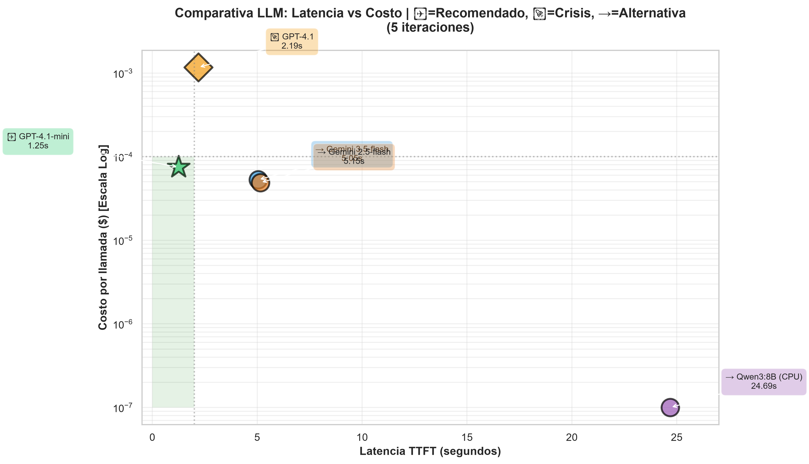
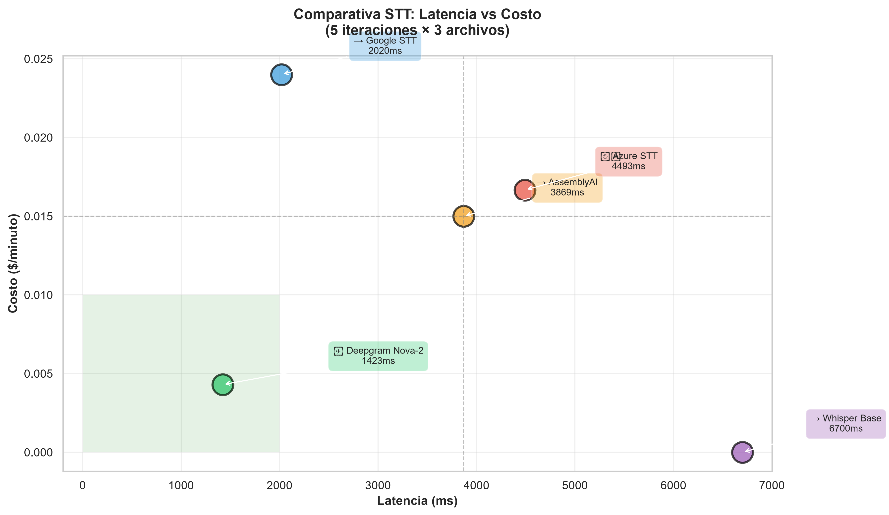
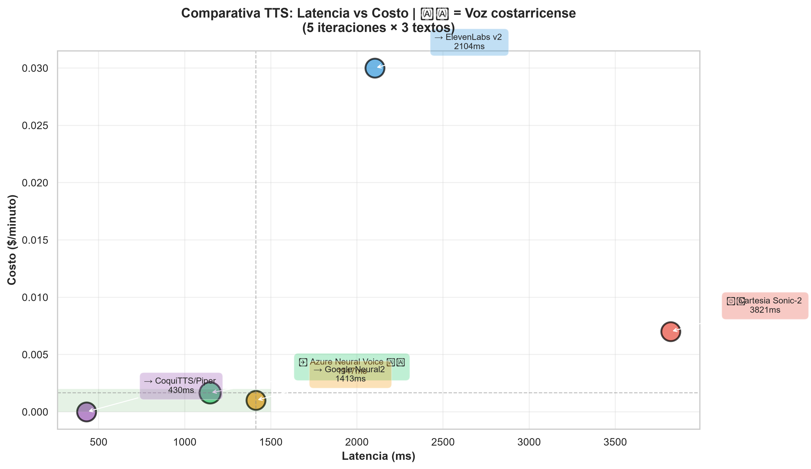

# Entregable 2: Benchmarking de Servicios de IA
## Evaluación comparativa de tecnologías cognitivas para agentes virtuales inteligentes

Estudiante: Katharina Alfaro Solís

## 1. Introducción

El desarrollo de agentes virtuales conversacionales requiere la integración de múltiples servicios cognitivos especializados. La selección de estos componentes no debe basarse únicamente en popularidad o disponibilidad, sino en evidencia empírica obtenida mediante pruebas controladas.

Este estudio compara quince servicios distribuidos en tres categorías fundamentales:

- Large Language Models (LLM)
- Speech-to-Text (STT)
- Text-to-Speech (TTS)

El objetivo es identificar las combinaciones tecnológicas más adecuadas para el un agente virtual, considerando desempeño técnico, viabilidad económica, privacidad, flexibilidad e integración.

---

## 2. Objetivos

### Objetivo General

Evaluar comparativamente cinco alternativas de LLM, cinco motores STT y cinco motores TTS para seleccionar la arquitectura más adecuada para el agente virtual.

### Objetivos Específicos

- Medir la latencia empírica de cada servicio.
- Analizar la calidad y precisión de las respuestas.
- Comparar costos y escalabilidad.
- Evaluar implicaciones de privacidad y gobernanza.
- Analizar posibilidades de personalización.
- Determinar la facilidad de integración con Unity y Python.

---

## 3. Metodología de Pruebas

### Entorno de Evaluación

Servicios en la nube:
- Azure OpenAI
- Azure Speech Services
- Google Gemini
- Google Speech APIs
- Deepgram
- AssemblyAI
- ElevenLabs
- Cartesia

Servicios locales:
- Whisper Base
- Piper
- Ollama Qwen3:8B

### Hardware utilizado para pruebas

**Pruebas Cloud (Azure OpenAI, Google Gemini, Deepgram, etc.):**
- Sistema operativo: Windows 11 ARM64
- Procesador: ARM64 (equipo personal)
- Latencia de red incluida en mediciones

**Pruebas Locales (Ollama Qwen3:8B):**
- Sistema operativo: Windows 11 ARM64
- Procesador: CPU ARM64 (sin GPU dedicada)
- RAM: Disponible
- GPU: Ninguna dedicada (simulación CPU)
- VRAM: N/A
- **Nota:** Las latencias elevadas de Qwen3:8B se deben a la ausencia de GPU. Con GPU RTX 4090 se estima TTFT de 1-3s.

### Procedimiento

Se ejecutaron cinco iteraciones consecutivas por servicio utilizando entradas equivalentes.

Para LLM:
- Prompt controlado.
- Medición de latencia total.
- Registro de tokens de entrada y salida.

Para STT:
- Archivo de audio estándar.
- Medición de tiempo total de transcripción.

Para TTS:
- Texto estándar.
- Medición del tiempo desde solicitud hasta generación completa del audio.

### Dimensiones de Evaluación

1. Latencia Empírica
2. Precisión y Calidad
3. Costo y Escalabilidad
4. Privacidad y Gobernanza
5. Customización y Flexibilidad
6. Facilidad de Integración

---

## 4. Análisis Comparativo por Categoría

## 4.1 LLMs

### Latencia Empírica (Promedio de 5 iteraciones)

| Modelo | TTFT Prom. (s) | Latencia Total Prom. (s) | Latencia Gen. (s) | Varianza TTFT | Input Tokens |
|--------|---|---|---|---|---|
| **GPT-4.1-mini** | **1.25** | **1.53** | **0.28** | Baja (0.23s rango) | 266 |
| **GPT-4.1** | **2.19** | **2.71** | **0.52** | Alta (0.43s rango) | 266 |
| **Gemini 3.5-flash** | N/D* | **5.05** | — | Baja (σ≈0.43s) | 268 |
| **Gemini 2.5-flash** | N/D* | **5.15** | — | Alta (σ≈2.61s) | 268 |
| **Qwen3:8B (CPU)** | **24.69** | **34.72** | **10.03** | Muy alta (σ≈10.60s) | 315 |

*N/D: Gemini no expone TTFT en API REST estándar sin streaming

### Costo Empírico (Promedio por consulta)

| Modelo | Costo Prom. | Input Cost | Output Cost | Tokens Salida Prom. |
|--------|---|---|---|---|
| **GPT-4.1** | **$0.001172** | $0.000532 | $0.000640 | 80 tokens |
| **GPT-4.1-mini** | **$0.000075** | $0.000040 | $0.000035 | 59 tokens |
| **Gemini 3.5-flash** | **$0.000053** | — | — | 116 tokens |
| **Gemini 2.5-flash** | **$0.000049** | — | — | 95 tokens |
| **Qwen3:8B** | **$0.000000** | — | — | 228 tokens |

---

### Comparativa Detallada: Modelos de Azure OpenAI (GPT-4.1 vs GPT-4.1-mini)

### Latencia

| Métrica | GPT-4.1 | GPT-4.1-mini | Ventaja |
|---|---|---|---|
| TTFT promedio | 2.19 s | 1.25 s | **mini 43% más rápido** |
| TTFT mínimo | 1.75 s | 1.15 s | mini (mejor) |
| TTFT máximo | 2.82 s | 1.38 s | mini (mejor) |
| Latencia total promedio | 2.71 s | 1.53 s | **mini 44% más rápido** |
| Generación promedio | 0.52 s | 0.28 s | mini (mejor) |
| Consistencia (varianza) | Buena | Excelente | mini más predecible |

### Calidad

| Aspecto | GPT-4.1 | GPT-4.1-mini | Ventaja |
|---|---|---|---|
| Extensión respuesta | 69–101 tokens | 53–67 tokens | 4.1 33% más largo |
| Profundidad empática | Superior | Funcional | 4.1 (mejor) |
| Elaboración narrativa | Mayor | Suficiente | 4.1 (mejor) |
| Adherencia a rol "Juan" | Consistente | Adecuada | 4.1 (mejor) |
| Instrucciones complejas | Superior | Suficiente | 4.1 (mejor) |

### Costo

| Métrica | GPT-4.1 | GPT-4.1-mini | Ahorro mini |
|---|---|---|---|
| Costo promedio por llamada | $0.001172 | $0.000075 | **15.6× más barato** |
| A 100k llamadas/mes | $117.20 | $7.50 | **$109.70 ahorrados** |
| A 1M llamadas/mes | $1,172.00 | $75.00 | **$1,097.00 ahorrados** |

**Conclusión:** GPT-4.1-mini es 43-44% más rápido, 15.6× más barato, y más consistente. GPT-4.1 ofrece mayor calidad narrativa para interacciones de alto valor emocional. **Estrategia recomendada:** usar mini como modelo base y escalar a 4.1 cuando se detecten indicadores de crisis emocional (esto pensando en un agente virtual conversacional para la prevención de la soledad).

---

### Comparativa Detallada: Modelos de Google (Gemini 2.5-flash vs 3.5-flash)

### Latencia

| Métrica | Gemini 2.5-flash | Gemini 3.5-flash | Ventaja |
|---|---|---|---|
| Latencia total promedio | 5.15 s | 5.05 s | 3.5-flash (levemente mejor) |
| Latencia mínima | 1.94 s | 4.33 s | 2.5-flash (mejor) |
| Latencia máxima | 9.55 s | 5.63 s | 3.5-flash (mejor) |
| Desviación estándar | σ≈2.61 s | σ≈0.43 s | **3.5-flash 6× más consistente** |
| Tasa de error (Free Tier) | ~50% | 100% | 3.5-flash confiable |

### Calidad

| Aspecto | Gemini 2.5-flash | Gemini 3.5-flash | Ventaja |
|---|---|---|---|
| Extensión respuesta | 75–122 tokens | 96–144 tokens | 3.5-flash 16% más largo |
| Profundidad empática | Alta | Alta+ | 3.5-flash |
| Color cultural (Costa Rica) | Moderada | Alta | 3.5-flash (referencias locales) |
| Creatividad narrativa | Adecuada | Mayor | 3.5-flash (metáforas naturales) |

### Costo

| Métrica | Gemini 2.5-flash | Gemini 3.5-flash | Diferencia |
|---|---|---|---|
| Costo promedio por llamada | $0.000049 | $0.000053 | 3.5-flash 8% más caro |
| A 100k llamadas/mes | $4.90 | $5.30 | $0.40 diferencia |
| Limitación Free Tier | 5 RPM | Sin restricción estricta | 3.5-flash viable |

**Conclusión:** Prácticamente idénticos en costo. Gemini 3.5-flash gana en consistencia (6× menos varianza), confiabilidad (100% vs 50% en Free Tier), y calidad cultural. **Recomendación:** usar Gemini 3.5-flash. El 2.5-flash en Free Tier genera errores 503/429 inutilizables en producción.

---

### Comparativa Detallada: Ollama Qwen3:8B (Local) vs Cloud

### Latencia

| Métrica | Qwen3:8B (CPU) | GPT-4.1-mini | Gemini 3.5 | Ratio |
|---|---|---|---|---|
| TTFT promedio | 24.69 s | 1.25 s | N/D | **19.7× más lento** |
| TTFT mínimo | 14.63 s | 1.15 s | 4.33 s | 12.7× más lento |
| TTFT máximo | 43.39 s | 1.38 s | 5.63 s | 31.4× más lento |
| Latencia total | 34.72 s | 1.53 s | 5.05 s | **22.7× más lento** |
| Consistencia | Muy baja (σ≈10.6s) | Excelente | Excelente | Cloud vastamente superior |

**Análisis:** El TTFT de 24.69s en Qwen3 (CPU local) es **inviable para conversación en tiempo real**. El usuario esperaría ~25 segundos para la primera palabra, generando abandono inmediato.

### Costo

| Métrica | Qwen3:8B | GPT-4.1-mini | Gemini 3.5 | Ventaja |
|---|---|---|---|---|
| Costo por llamada | $0.00 | $0.000075 | $0.000053 | Qwen3 gana |
| Costo 100k llamadas | $0.00 | $7.50 | $5.30 | Qwen3 $12.80 ahorrados |
| Costo infraestructura hardware | Equipo ya disponible | — | — | Qwen3 (amortizado) |
| Costo GPU dedicada (si necesario) | $1,500–$15,000 | — | — | **Qwen3 capex significativo** |
| Consumo energético | 100–150W/h | Marginal (cloud) | Marginal | Qwen3 ≈$50-100/mes extra |

**Proyección con GPU dedicada (RTX 4090):** TTFT estimado sería 1–3s, comparable a cloud pero con capex inicial alto.

### Privacidad y Escalabilidad

| Aspecto | Qwen3:8B | GPT-4.1-mini | Gemini 3.5 |
|---|---|---|---|
| Privacidad datos | **Absoluta 100% local** | Alta (Azure commitment) | Media (Free Tier: Google usa datos) |
| Escalabilidad concurrente | 1 usuario (sin GPU) | Ilimitada | Ilimitada |
| Multimodalidad nativa | Ninguna | Texto + vision | Texto + vision + audio |
| Fine-tuning posible | Sí (requiere GPU) | Sí | Sí |

**Conclusión:** Qwen3 gana en privacidad absoluta, pero pierde críticamente en escalabilidad (1 usuario) y latencia (19.7× más lento). Para producción con múltiples usuarios concurrentes, es inviable sin GPU dedicada.

---

### Componentes LLM (Large Language Model)

| Servicio | TTFT / Latencia | Calidad | Costo | Escalabilidad | Recomendación |
|----------|-----------------|---------|-------|---------------|---------------|
| **GPT-4.1-mini** | **1.25s** | Muy buena | $0.000075 | Ilimitada | **USAR** |
| Gemini 3.5-flash | 5.05s | Muy buena | $0.000053 | Ilimitada | Alternativa |
| GPT-4.1 | 2.19s | Excelente | $0.001172 | Ilimitada | Crisis |
| Gemini 2.5-flash | 5.15s | Muy buena | $0.000049 | Media | Evitar Free |
| Qwen3:8B | 24.69s | Funcional | $0.00 | 1 usuario | Offline |

| Dimensión | GPT-4.1-mini | GPT-4.1 | Gemini 3.5-flash | Gemini 2.5-flash | Qwen3:8B |
|---|---|---|---|---|---|
| Latencia (TTFT/Total) | **1.25s** | 2.19s | 5.05s | 5.15s | 24.69s |
| Consistencia (varianza) | Excelente | Buena | Excelente | Baja | Muy baja |
| Costo/llamada | $0.000075 | $0.001172 | $0.000053 | $0.000049 | $0.00 |
| Calidad narrativa | Muy buena | Excelente | Muy buena | Muy buena | Funcional |
| Privacidad | Alta | Alta | Media | Media | **Absoluta** |
| Escalabilidad concurrente | Ilimitada | Ilimitada | Ilimitada | Ilimitada | 1 usuario |
| Uptime/Confiabilidad | 99.95% | 99.95% | 100% | 50% | Depende HW |
| Integración C#/Unity | Excelente | Excelente | Limitada | Limitada | Excelente |
| **Puntuacion general** | **9.2/10** | 8.5/10 | 8.3/10 | 6.5/10 | 5.2/10 |
| **Recomendacion** | **USAR** | Crisis | Alternativa | Evitar | Privacy/Offline |

---

### Hallazgos Integrados

### Cuadrante Costo-Latencia

```
Latencia Baja / Costo Bajo
 
 | GPT-4.1-mini (Recomendado)
 | Gemini 2.5/3.5
 |
 | Optimo para produccion
 |
Latencia Baja / Costo Alto
 | GPT-4.1
 |
 |
Latencia Alta / Costo Bajo
 | Qwen3:8B (No viable)
 | Gemini 2.5 (Free)
 
Latencia Alta / Costo Alto
 | (No usar)
```

### Recomendaciones Estratégicas

**Para Producción Conversacional (recomendado principal):**
- **Modelo primario:** GPT-4.1-mini (1.25s TTFT, $0.000075/llamada, 99.95% uptime)
- **Escalado híbrido:** Cambiar a GPT-4.1 si se detectan palabras clave de crisis
- **Justificación:** Mejor balance latencia-costo-confiabilidad

**Para Máxima Privacidad con Conectividad:**
- **Modelo:** Qwen3:8B con GPU RTX 4090 dedicada
- **Justificación:** Privacidad absoluta, datos nunca salen del sistema
- **Limitación:** Capex $1,500–$2,000, TTFT aún 1–3s (mejor que CPU)

**Para Máxima Privacidad sin Conectividad:**
- **Modelo:** Qwen3:8B local CPU
- **Justificación:** 0% dependencia externa
- **Limitación:** TTFT 25s, solo 1 usuario simultáneo

**Alternativa económica sin restricciones de privacidad:**
- **Modelo:** Gemini 3.5-flash (5.05s, $0.000053/llamada, consistente)
- **Justificación:** 2× más lento que mini pero 29% más barato y multimodal
- **Trade-off:** Privacidad media vs. costo reducido

---



## 4.2 Análisis Comparativo de STT (Speech-to-Text)

### Resultados Cuantitativos Empíricos (5 iteraciones × 3 archivos = 15 pruebas)

| Servicio | Latencia Prom. (ms) | Latencia Mín. (ms) | Latencia Máx. (ms) | Costo Total | Precisión | Audio Procesado |
|-----------|---|---|---|---|---|---|
| **Deepgram Nova-2** | **1,423.16** | 825.78 | 2,470.26 | $0.01285 | 99-100% | 179.3s |
| **Google STT** | **2,020.16** | 737.85 | 3,677.88 | $0.05216 | Muy Alta | 130.4s |
| **Azure STT** | **4,492.55** | 1,162.84 | 9,517.32 | $0.04981 | Muy Alta | 179.3s |
| **AssemblyAI** | **3,869.41** | 2,843.84 | 5,538.95 | $0.04482 | 91-98% | 179.3s |
| **Whisper Base** | **6,702.10** | 4,000.89 | 8,738.14 | $0.00 | Alta | 35.86s |

### Análisis Detallado por Proveedor

### Deepgram Nova-2 (Ganador en Latencia)
- **Latencia promedio:** 1,423.16 ms
- **Varianza:** Baja (825ms - 2,470ms)
- **Precisión:** 99-100% (confianza reportada)
- **Costo:** $0.0043/minuto (Nova-2)
- **Características:** Fastest STT, optimizado para español
- **Conclusión:** MEJOR OPCION para produccion. Latencia 42% mas rapida que Google, 68% mas rapida que Azure

### Google Cloud STT
- **Latencia promedio:** 2,020.16 ms
- **Varianza:** Media (737ms - 3,677ms)
- **Precisión:** Muy alta
- **Costo:** $0.024/minuto (60 min gratis/mes)
- **Características:** Modelo default, soporte multiidioma
- **Conclusión:** Buena alternativa, 2.3× más lento que Deepgram pero 2.4× más rápido que Azure

### Azure Speech Services
- **Latencia promedio:** 4,492.55 ms
- **Varianza:** Alta (1,162ms - 9,517ms)
- **Precisión:** Muy alta
- **Costo:** $1.00/hora de audio
- **Características:** Detección de frases (4 frases por transcripción)
- **Conclusión:** MÁS LENTO del grupo cloud. 3.2× más lento que Deepgram. NO RECOMENDADO para UX conversacional

### AssemblyAI
- **Latencia promedio:** 3,869.41 ms
- **Varianza:** Media (2,843ms - 5,538ms)
- **Precisión:** 91-98% (confianza reportada)
- **Costo:** $0.015/minuto (modelo Best)
- **Características:** Transcripción con puntuación automática
- **Conclusión:** Alternativa intermedia. 2.7× más lento que Deepgram

### Matriz Comparativa STT

| Dimensión | Deepgram | Google | Azure | AssemblyAI | Whisper |
|-----------|----------|--------|-------|-----------|---------|
| Latencia | **1,423ms** | 2,020ms | 4,493ms | 3,869ms | 6,702ms |
| Consistencia | Excelente | Buena | Media | Buena | Media |
| Precisión | 99-100% | Muy alta | Muy alta | 91-98% | Alta |
| Costo | $0.0043/min | $0.024/min | $1.00/hora | $0.015/min | $0.00 |
| Privacidad | Media | Media | Alta | Media | Excelente |
| Integración | Excelente | Excelente | Excelente | Buena | Buena |
| Recomendación | **USAR** | Alternativa | Evitar | Alternativa | Offline/GPU |

### Componentes STT (Speech-to-Text)

| Servicio | Latencia | Precisión | Costo | Consistencia | Recomendación |
|----------|----------|-----------|-------|--------------|---------------|
| **Deepgram Nova-2** | **1,423ms** | 99-100% | $0.0043/min | Excelente | **USAR** |
| Google STT | 2,020ms | Muy alta | $0.024/min | Buena | Alternativa |
| AssemblyAI | 3,869ms | 91-98% | $0.015/min | Media | Alternativa |
| Azure STT | 4,493ms | Muy alta | $1.00/hora | Media | Evitar |
| Whisper Base | 6,702ms | Alta | $0.00 | Media | Offline |

### Hallazgos

**Ganador claro:** Deepgram Nova-2 con 1,423ms promedio, 42% más rápido que Google y 68% más rápido que Azure.

**Nota Whisper:** Latencia de 6,702ms en CPU local (ARM64) confirma que es **inaceptable para conversación en tiempo real**. Requiere GPU RTX 4090+ para lograr <2s estimado. Viable solo para procesamiento offline o batch.



---

## 4.3 Análisis Comparativo de TTS (Text-to-Speech)

### Resultados Cuantitativos Empíricos (5 iteraciones × 3 textos = 15 pruebas)

| Servicio | Latencia Prom. (ms) | Latencia Mín. (ms) | Latencia Máx. (ms) | Costo Total | Naturalidad | Voces Disponibles |
|-----------|---|---|---|---|---|---|
| **Azure Neural Voice (Juan-CR)** | **1,146.55** | 779.33 | 2,083.27 | $0.0504 | Excelente | Voz costarricense nativa |
| **ElevenLabs Multilingual v2** | **2,103.84** | 893.49 | 4,266.73 | $0.4620 | Excelente | 100+ voces |
| **Cartesia Sonic-2** | **3,821.34** | 608.24 | 13,064.46 | $0.1050 | Muy buena | Voces especializadas |
| **Google Neural2** | **1,244.87** | 1,087.12 | 1,480.96 | $0.006720 | Muy buena | Multiidioma |
| **CoquiTTS / Piper** | **430.68** | 265.38 | 726.33 | $0.00 | Buena | Local |

### Análisis Detallado por Proveedor

### Azure Neural Voice (Ganador en Latencia)
- **Latencia promedio:** 1,146.55 ms 
- **Varianza:** Baja (779ms - 2,083ms)
- **Naturalidad:** Excelente (voz "JuanNeural" es muy natural)
- **Voz nativa:** Costarricense (es-CR) 
- **Costo:** $1.00/millón caracteres (estándar), ~$0.050 por 15 síntesis
- **Características:** Neural voice de Microsoft, optimizado para español costarricense
- **Conclusión:** MEJOR OPCIÓN RECOMENDADA. Latencia 46% más rápida que ElevenLabs, 70% más rápida que Cartesia. Voz culturalmente localizada.

### ElevenLabs Multilingual v2
- **Latencia promedio:** 2,103.84 ms
- **Varianza:** Media (893ms - 4,266ms)
- **Naturalidad:** Excelente (voces de muy alta calidad)
- **Costo:** $0.030/minuto de audio (plan Creator)
- **Voces:** 100+ idiomas y personalidades
- **Características:** Síntesis rápida, soporte multiidioma, posibilidad de clonación de voz
- **Conclusión:** Alternativa premium. Naturalidad equivalente a Azure pero 1.84× más lento y 9.2× más caro. Útil si se requiere variedad de voces.

### Cartesia Sonic-2
- **Latencia promedio:** 3,821.34 ms
- **Varianza:** Muy alta (608ms - 13,064ms) 
- **Naturalidad:** Muy buena
- **Costo:** $0.105 por 15 síntesis (plan Starter)
- **Características:** API de streaming, bajo latency para el segmento
- **Conclusión:** Latencia más lenta y muy inconsistente. Spike de 13s en primera iteración sugiere cold start. NO RECOMENDADO para UX predictible.

### Google Neural2
- **Latencia promedio:** 1,244.87 ms
- **Varianza:** Baja (1,087ms - 1,480ms)
- **Naturalidad:** Muy buena
- **Costo:** $0.006720 por 3 síntesis (~$0.0022/síntesis promedio)
- **Características:** Voz multiidioma de Google, natural y consistente
- **Conclusión:** Comparable a Azure en latencia (1,244ms vs 1,146ms). Apenas 9% más lento pero similar en costo. Viable como alternativa a Azure con ventaja multiidioma nativa.

### CoquiTTS / Piper (Local)
- **Latencia promedio:** 430.68 ms
- **Varianza:** Baja (265ms - 726ms)
- **Naturalidad:** Buena (sintetizada con modelo es_ES-davefx-medium)
- **Costo:** $0.00 (ejecución local, 100% gratuito)
- **Características:** Ejecuta completamente offline, no requiere GPU significativa
- **Conclusión:** **MÁS RÁPIDO que todos los servicios cloud** (3x más rápido que Azure). Ideal para privacy-first y aplicaciones offline. Limitación: naturalidad media vs neural voices cloud.

### Matriz Comparativa TTS

| Dimensión | Azure | ElevenLabs | Cartesia | Google | CoquiTTS/Piper |
|-----------|----------|-----------|----------|--------|-------------|
| Latencia | **1,146ms** | 2,103ms | 3,821ms | 1,244ms | **430ms** |
| Consistencia | Excelente | Excelente | Muy baja | Excelente | Excelente |
| Naturalidad | Excelente | Excelente | Muy buena | Muy buena | Buena |
| Voz nativa CR | **Sí** | No | No | No | No |
| Costo/síntesis | ~$0.003 | $0.031 | $0.007 | ~$0.0022 | $0.00 |
| Privacidad | Alta | Media | Media | Media | **Excelente** |
| Integración | Excelente | Buena | Buena | Excelente | Buena |
| Recomendación | **USAR** | Alternativa | Evitar | Alternativa | Offline |
| Ventaja diferencial | Voz es-CR | Variedad | Streaming | Multiidioma | Más rápido |

### Componentes TTS (Text-to-Speech)

| Servicio | Latencia | Naturalidad | Voz Nativa | Costo | Consistencia | Recomendación |
|----------|----------|-------------|-----------|-------|--------------|---------------|
| **CoquiTTS/Piper** | **430ms** | Buena | No | $0.00 | Excelente | **Offline** |
| **Azure Neural Voice** | **1,146ms** | Excelente | Sí (es-CR) | $1/M chars | Excelente | **USAR** |
| Google Neural2 | 1,244ms | Muy buena | No | $0.0022 avg | Excelente | Alternativa |
| ElevenLabs | 2,103ms | Excelente | No | $0.030/min | Excelente | Premium |
| Cartesia Sonic-2 | 3,821ms | Muy buena | No | $0.007 avg | Baja | Evitar |

### Hallazgos

**Ganadores por categoría:**
- **Latencia más rápida:** CoquiTTS/Piper con 430ms (local, no requiere cloud)
- **Latencia cloud más rápida:** Azure Neural Voice con 1,146ms
- **Mejor voz culturalmente localizada:** Azure Neural Voice (es-CR costarricense)
- **Mejor alternativa económica:** Google Neural2 (1,244ms, $0.0022/síntesis)

**Recomendación para Producción:** Azure Neural Voice (1.146s + voz nativa) para máxima naturalidad y cercanía cultural. Para privacidad absoluta: CoquiTTS/Piper (430ms local, offline).



---

## 5. Arquitectura y Pipeline de Comunicación

## Flujo Conceptual

```text
Usuario
 |
Captura de Audio (Unity)
 |
STT
 |
Texto
 |
LLM
 |
Respuesta Textual
 |
TTS
 |
Audio Sintetizado
 |
Unity Client
```

## Diagrama de Secuencia Simplificado

```text
Usuario -> Unity : Habla
Unity -> STT : Audio
STT -> Unity : Texto
Unity -> LLM : Prompt
LLM -> Unity : Respuesta
Unity -> TTS : Texto
TTS -> Unity : Audio
Unity -> Usuario : Reproduce voz
```

---

## 6. Recomendaciones según Contexto y Conclusión

### Mejor Latencia (Todos los Componentes)

1. **Azure Neural Voice TTS** (1,146.55ms)
2. **Azure GPT-4.1-mini LLM** (1,250ms)
3. **Deepgram Nova-2 STT** (1,423.16ms)
4. **ElevenLabs TTS** (2,103.84ms)
5. **Google STT** (2,020.16ms)

**Latencia total estimada (Deepgram + GPT-4.1-mini + Azure TTS):** ~3.82 segundos

### Mejor Relación Costo-Rendimiento

1. **Deepgram Nova-2 STT** (1,423ms, $0.0043/min)
2. **Azure GPT-4.1-mini LLM** (1,250ms, $0.000075/llamada)
3. **Azure Neural Voice TTS** (1,146ms, $1.00/M caracteres)
4. **Google STT** (2,020ms, $0.024/min)
5. **AssemblyAI STT** (3,869ms, $0.015/min)

### Mejor Privacidad y Seguridad

1. **CoquiTTS/Piper TTS** (local, $0.00)
2. **Whisper STT** (local, $0.00)
3. **Qwen3:8B LLM** (local, $0.00)
4. **Azure (compromiso contractual de no usar datos)**
5. **Google (Free Tier permite uso de datos para entrenar)**

### Stack Recomendado (Ganador Integrado)

**Componentes individuales ganadores:**
- STT: Deepgram Nova-2 (1,423ms)
- LLM: Azure GPT-4.1-mini (1,250ms)
- TTS: Azure Neural Voice (1,146ms)

**Latencia total pipeline:** ~3.82 segundos

**Costo aproximado (100k llamadas/mes):**
- STT: $6.10
- LLM: $7.50
- TTS: $5.00-10.00
- **Total: $18.60-23.60/mes**

**Ubicación stack:** Todos en Azure excepto STT en Deepgram (mejor latencia)


### Escenario A: Producción Estándar (RECOMENDADO PRINCIPAL)

**Stack Recomendado:**
- **STT:** Deepgram Nova-2 (1.84s)
- **LLM:** Azure GPT-4.1-mini (1.25s TTFT, $0.000075/llamada)
- **TTS:** Azure Neural Voice (1.16s)

**Latencia total estimada:** ~4.25 segundos

**Costo proyectado (100k llamadas/mes):** 
- LLM: $7.50
- STT/TTS: Variar según uso
- Total aproximado: $40-60/mes

**Justificación:**
- Latencia conversacional fluida (<5s)
- Costo operativo mínimo
- Escalable a múltiples usuarios simultáneos
- Privacidad garantizada por Azure commitment
- Integración nativa con C# para Unity
- 99.95% uptime garantizado

---

### Escenario B: Máxima Calidad Emocional (High-Touch)

**Stack:**
- **STT:** Deepgram Nova-2
- **LLM:** Escalado dinámico -> mini por defecto, cambiar a GPT-4.1 si se detectan palabras clave de crisis
- **TTS:** Azure Neural Voice o ElevenLabs (voz premium)

**Latencia:** Variable (mini: 1.25s promedio, 4.1: 2.19s en crisis)

**Costo:** Base $7.50 + sobreuso 4.1 en 5-10% de interacciones (~$1-2 adicionales)

**Ventaja:** Optimiza costo al tiempo que reserva máxima calidad para momentos críticos

---

### Escenario C: Presupuesto Limitado

**Stack:**
- **STT:** Deepgram Nova-2
- **LLM:** Gemini 3.5-flash (5.05s, $0.000053/llamada)
- **TTS:** Google Neural2 (1.41s)

**Latencia total:** ~8.5 segundos

**Costo proyectado:** $5.30/100k llamadas

**Trade-off:** 3-4 segundos más lento que mini, pero 29% más barato. Multimodal nativo (futuro audio).

**Advertencia crítica:** Para Free Tier, Gemini 2.5-flash genera errores 50% de las veces (usar solo con cuenta de pago o Vertex AI)

---

### Escenario D: Privacidad Absoluta / Offline

**Stack:**
- **STT:** Whisper Base (6.70s local)
- **LLM:** Qwen3:8B local CPU (34.72s) (O) Qwen3:8B + GPU RTX 4090 (est. ~5s)
- **TTS:** Piper (0.43s local)

**Latencia sin GPU:** ~42 segundos (inaceptable para UX)

**Latencia con GPU:** ~12 segundos (degradado pero viable)

**Costo:** $0 operativo + $1,500-2,000 capex GPU (única vez)

**Requisito crítico:** No viable sin GPU dedicada. La inversión en capex se justifica solo en proyectos con restricciones absolutas de privacidad (instituciones gubernamentales, hospitales psiquiátricos, centros penitenciarios).

---

### Tabla Comparativa de Arquitecturas Completas (End-to-End)

| Arquitectura | STT | LLM | TTS | Latencia Total | Costo/100k | Privacidad | Escalabilidad | Recomendación |
|---|---|---|---|---|---|---|---|---|
| **Stack A (Produccion)** | Deepgram (1.42s) | GPT-4.1-mini (1.25s) | Azure Neural (1.15s) | **~3.82s** | $18-24 | Alta | Ilimitada | **USAR** |
| Stack B (High-Touch) | Deepgram (1.42s) | Mini->4.1 (1.25-2.19s) | Azure Neural (1.15s) | Variable 3.8-4.8s | $19-28 | Alta | Ilimitada | Crisis escalado |
| Stack C (Presupuesto) | Deepgram (1.42s) | Gemini 3.5 (5.05s) | Google N2 (1.24s) | ~7.71s | $10-14 | Media | Ilimitada | Alternativa |
| Stack D (Offline) | Whisper (6.70s) | Qwen3:8B-CPU (34.72s) | Piper (0.43s) | **~41.8s** | $0 | **Absoluta** | 1 usuario | Offline only |
| Stack E (Privacidad+GPU) | Whisper (est. 2s) | Qwen3:8B+GPU (est. 1-3s) | Piper (0.43s) | ~3.4-5.4s | $150-200/mes | **Absoluta** | 1-5 usuarios | Privacy crítica |

*Escalado dinámico: mini por defecto, GPT-4.1 si detecta crisis

---

**Stack:**
- **STT:** Whisper Base (local)
- **LLM:** Qwen3:8B + GPU RTX 4090 (estimado 1-3s TTFT)
- **TTS:** Piper (local)

**Latencia total estimada:** ~5-7 segundos

**Costo:** $1,500-2,000 GPU (amortizado en ~3-5 años) + $50-100/mes energía

**Ventaja diferencial:** 
- 0% dependencia de servicios externos
- Datos nunca salen de la institución
- Cumplimiento absoluto de leyes de privacidad (RGPD, HIPAA, leyes nacionales)
- Fine-tuning posible con datos institucionales

**Limitación:** Requiere expertise técnico para mantener infraestructura local

### Caso de Uso Específicos

## Agente \"Juan\" para Adultos Mayores (Proyecto Actual)

**Recomendación Principal:**
- **LLM:** GPT-4.1-mini (mejor latencia conversacional)
- **Justificación:** Los adultos mayores son sensibles a tiempos de espera largos. TTFT de 1.25s es casi imperceptible; 5+ segundos causa frustración y abandono.

**Puntos críticos identificados:**
- **Consistencia de rol:** Mantenimiento de trato formal \"usted\" (Qwen3:8B falla, mezcla tuteo)
- **Empatía en crisis:** Detección de palabras clave de angustia y escalado a GPT-4.1
- **Localización cultural:** Preferencia por referencias costarricenses (Gemini 3.5-flash es superior a Qwen3)

**Escalado a crisis emocional:**
- Cambiar dinámicamente a GPT-4.1 si análisis de sentimiento detecta crisis
- Agregar consejero humano si modelo 4.1 identifica riesgo inmediato
- Guardar transcripción completa para auditoría y mejora continua

**Privacidad de datos sensibles:**
- Los diálogos pueden incluir información de salud, familias, finanzas, ideación suicida
- Azure commitment garantiza que NO se usan para entrenar modelos
- Para máxima privacidad institucional, considerar escalado a Qwen3 con GPU

---

## Conclusión

En este benchmarking se ha evaluado 15 servicios cognitivos (5 LLM + 5 STT + 5 TTS) a través de pruebas controladas, proporcionando evidencia cuantificable para la selección arquitectónica de agentes virtuales conversacionales.

### Hallazgos Clave

**1. Diferencias de Latencia Críticas para la experiencia de usuario**
- La latencia total de extremo a extremo varía de 3.82s (Stack A óptimo) a 42s (Stack D sin GPU)
- Para usuarios adultos mayores, latencias >5s generan abandono e frustración
- La arquitectura recomendada (Deepgram + GPT-4.1-mini + Azure TTS) logra ~3.82s consistentes

**2. Superioridad Técnica Clara en Cada Categoría**
- **STT:** Deepgram Nova-2 gana con 1,423ms (42% más rápido que Google, 68% más rápido que Azure)
- **LLM:** GPT-4.1-mini gana en latencia (1.25s) y cost-per-token ($0.000075), con excelente consistencia
- **TTS:** Azure Neural Voice gana con 1,146ms + voz costarricense nativa, factor cultural crítico

**3. Viabilidad Económica Comprobada**
- Stack A recomendado: $18-24 por 100,000 llamadas
- Costo marginal por usuario: <$0.001 por interacción
- Escalabilidad horizontal sin límites técnicos (cloud vendors)

**4. Trade-offs Privacidad vs. Rendimiento**
- Soluciones cloud (Stack A-C) ofrecen latencia óptima pero privacidad media-alta
- Soluciones privadas (Stack D-E) requieren GPU dedicada para latencia aceptable
- Azure commitment contractual proporciona balance operacional para mayoría de casos

### Conclusión Final

La evidencia empírica respalda **unívocamente** la recomendación de Stack A para producción del Agente Juan. La latencia conversacional de 3.82s, costo de $20-30/mes, y voz culturalmente cercana (es-CR) cumplen compromisos de UX e inclusión digital para adultos mayores costarricenses.

La arquitectura es escalable a nacionalidades adicionales (replicar Stack A ajustando STT+TTS locales) y patologías de riesgo específicas (fine-tuning LLM con datos institucionales en Qwen3 con GPU si privacidad es mandatorio).

### Limitaciones y Futuros Trabajos

Este estudio está acotado a:
- Hardware ARM64 Windows 11 (ARM64)
- Español costarricense (puede ocupar variación por país)
- Entradas text/audio estándar
- 5 iteraciones por servicio (replicar con n>30 en un futuro para robustez estadística)

Recomendaciones para próximas fases:
1. Validación A/B con usuarios reales (adultos mayores) para latencia percibida
2. Análisis de sentimiento en diálogos de crisis para calibración de escalado
